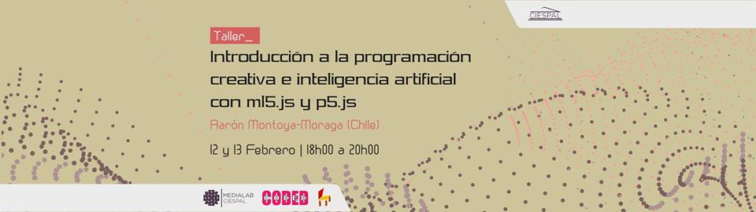

# workshop-inteligencia-artificial-ml5js-p5js-quito-ecuador-medialabciespal-2019

Workshop inteligencia artificial con ml5.js, 12-13 febrero 2019, 6pm-8pm, MediaLabCiespal, Quito, Ecuador.

Workshop para estudiantes sin conocimientos previos de programación. Los estudiantes aprenderán fundamentos aprendizaje de máquinas y programación de aplicaciones web interactivas.

Los estudiantes aprenderán estructuras de páginas web y lenguajes HTML, CSS y JavaScript con la biblioteca p5.js y sobre cómo usar y programar modelos de inteligencia artificial con la biblioteca ml5.js.

Se les dará acceso a material educativo gratuito para seguir aprendiendo después del workshop, incluyendo material de la comunidad en torno a [ml5.js](https://ml5js.org/), [p5.js](https://p5js.org/es/), el libro gratuito [Machine Learning for Artists](http://ml4a.github.io/) de [Gene Kogan](http://genekogan.com/) y el libro [Introducción a p5.js](https://processingfoundation.press/es/product/introduccion-a-p5-js/), disponible en formato PDF paga-lo-que-quieras.

## Acerca de

Este workshop de Introducción a la programación creativa e inteligencia artificial con ml5.js y p5.js fue diseñado y es impartido por [Aarón Montoya-Moraga](http://montoyamoraga.io/). Este workshop incluye trabajo y material que ya ha sido usado por Aarón en workshops similares.

Esta versión fue enseñada en [MediaLabCiespal](https://www.facebook.com/medialabciespal/),Quito, Ecuador, los días martes 12 y miércoles 13 febrero 2019, gracias a una invitación hecha por [Gabriel Andrade](http://www.gandradep.com/).

Fue una actividad gratuita con un pago opcional para obtener certificado.

Link a [evento en Facebook](https://www.facebook.com/events/322115415088536/)

## Flyer




## Temario

* [Sobre el instructor](#sobre-el-instructor)
* [Sobre les alumnes](#sobre-les-alumnes)
* [Mi comunidad](#mi-comunidad)
* [Software a usar](#software-a-usar)
* [Introducción a inteligencia artificial](#)
* [Historia de ml5.js](#historia-de-ml5js)
* [Historia de p5.js y Processing](#historia-de-p5js-y-processing)
* [Integración ml5.js con p5.js](#integración-ml5js-con-p5js)

## Sobre el instructor

[Aarón Montoya-Moraga](http://montoyamoraga.io/) es ingeniero eléctrico, músico, programador y artista chileno. Se graduó y fue residente de investigación en el Programa de [Telecomunicaciones Interactivas](https://tisch.nyu.edu/itp) de la [Universidad de Nueva York](https://www.nyu.edu/). Enseña introducción a la programación y FLOSS para las artes en [CODED Escuela](http://codedescuela.cl/), que incluye [Pure Data](http://puredata.info/) y [ChucK](http://chuck.cs.princeton.edu/) para arte sonoro, [Python](https://www.python.org/) para poesía, [p5.js](https://p5js.org/es/) y [Processing](https://processing.org/) para artes visuales. Es colaborador del proyecto [p5.js](https://p5js.org/es/) y ha traducido a español el libro [Introducción a p5.js](https://processingfoundation.press/es/) para Processing Foundation. Dirige el sello de música [bandurria](https://bandurria.io/).

### Sobre les alumnes

Haremos presentaciones de [90 segundos](https://www.google.com/search?rlz=1C5CHFA_enUS813US813&q=timer+90+seconds)

Por favor responde estas preguntas:

* Nombre?
* Por qué viniste a este curso?
* Experiencia programar?
* Experiencia inteligencia artificial?

## Mi comunidad

* [Afrotectopia](https://www.afrotectopia.com/), festival de artes mediales, cultura y tecnología organizado por [Ari Melenciano](http://ariciano.com/).

* [CODED Escuela](http://codedescuela.cl/), colectivo chileno de educación de artes mediales, conformada por [Aarón Montoya-Moraga](http://montoyamoraga.io/), [Camila Colussi](https://www.camilacolussi.com/), [Christian Oyarzún](http://error404.cl/), [Guillermo Montecinos]() y [Natalia Cabrera](http://www.nataliacabrera.com/). Enseñan introducción a la programación para arte gráfico con p5.js, arte sonoro con ChucK, poesía con Python, entre otros.

* [The Coding Train](https://www.youtube.com/user/shiffman): canal de Youtube dedicado a la enseñanza de programación creativa, por [Daniel Shiffman](https://shiffman.net/).

* [Kadenze](https://www.kadenze.com/): cursos en línea, incluye [Introduction to Programming for the Visual Arts with p5.js](https://www.kadenze.com/courses/introduction-to-programming-for-the-visual-arts-with-p5-js-vi/info), por [Casey Reas](http://reas.com/) y [Lauren McCarthy](http://lauren-mccarthy.com/), y también [The Nature of Code](https://www.kadenze.com/courses/the-nature-of-code-ii/info), por [Daniel Shiffman](https://shiffman.net/).

* [New Latin Wave](https://newlatinwave.com/), festival de arte y cultura latinoamericana en New York, dirigido por Amanda Riesman y [Mauricio Diaz](http://sokio.me/).

* [NYU ITP](https://tisch.nyu.edu/itp), programa posgrado MPS, New York, New York, Estados Unidos. Aquí son profesores [Daniel Shiffman](https://shiffman.net/), [Allison Parrish](https://www.decontextualize.com/) entre otros. También existe un programa de pregrado asociado en China [NYU Shanghai IMA](https://shanghai.nyu.edu/academics/majors/interactive-media-arts) y en New York [NYU IMA](https://tisch.nyu.edu/itp).

* [NYU ITP](https://tisch.nyu.edu/itp), programa posgrado MPS, New York, New York, Estados Unidos. Aquí son profesores [Daniel Shiffman](https://shiffman.net/), [Allison Parrish](https://www.decontextualize.com/) entre otros.

* [School for Poetic Computation](http://sfpc.io/), New York, New York, Estados Unidos. Aquí son profesores [Taeyoon Choi](http://taeyoonchoi.com/) y [Zach Lieberman](http://thesystemis.com/), entre otros.

* [School of Machines, Making & Make-Believe](http://schoolofma.org/), Berlin, Alemania, dirigida por [Rachel Uwa](http://schoolofma.org/about/).

* [Sinestesia](http://sinestesia.cc/), laboratorio creativo y espacio de encuentro en torno a artes mediales en Santiago de Chile, cuyos miembros incluyen a [Sergio Mora-Diaz](http://www.sergiomoradiaz.com/) y [Joaquín González](http://www.sinestesia.cc/sinestesia-lie).

* [UCLA Design Media Arts](http://dma.ucla.edu/), programa posgrado MFA, Los Angeles, California, Estados Unidos. Aquí son profesores [Casey Reas](http://reas.com/) y [Lauren McCarthy](http://lauren-mccarthy.com/), entre otros.

## Introducción a inteligencia artificial para programación creativa

Hoy nos concentraremos en una rama de la [inteligencia artificial](https://es.wikipedia.org/wiki/Inteligencia_artificial) llamada [aprendizaje de máquinas](https://es.wikipedia.org/wiki/Aprendizaje_autom%C3%A1tico), cuyo objetivo de estudio es desarrollar técnicas que nuestros computadores aprendan.

Los computadores son máquinas capaces de hacer muchos cálculos de forma muy rápida, pero no poseen inherentemente nuestra capacidad humana de reconocer una cara, una voz, o de realizar pinturas abstractas.

El aprendizaje de máquinas nos permitirá crear programas capaces de generalizar comportamientos a partir de una información suministrada en forma de ejemplo, para que así el computador "aprenda" y tenga una "inteligencia".

Estos campos usualmente son estudiados por gente trabajando en ciencias e ingeniería, pero en esta década se han creado cursos para acercar estas áreas a estudiantes, diseñadores, artistas, músicos, y creativos.

Se destaca el aporte de las siguientes personas que han contribuido a la creación difusión de material educativo y obras de arte relacionadas a inteligencia artificial y aprendizaje de máquinas:

* [Alejandro Matamala](https://www.matamala.info/) y [Cristóbal Valenzuela](https://cvalenzuelab.com/), programadores y diseñadores, desarrolladores de la aplicación de inteligencia artificial para creatividad aumentada [Runway](https://runwayapp.ai/).
* [Andreas Refsgaard](http://andreasrefsgaard.dk/), diseñador de interacciones, artista y educador, co-fundador del estudio [Støj](http://stoj.io/).
* [Gene Kogan](http://genekogan.com/), artista y programador, profesor en instituciones como [School of Ma, Berlin](http://schoolofma.org/) y [NYU ITP](https://tisch.nyu.edu/itp), creador de la conferencia [alt-ai](http://alt-ai.net/), creador del libro gratuito y en línea [Machine Learning for Artists (ml4a)](http://ml4a.github.io/).
* [Hannah Davis](http://www.hannahishere.com/), artista y educadora, parte del equipo de [ml5.js](https://ml5js.org/) y profesora de música generativa en [NYU ITP](https://tisch.nyu.edu/itp).
* [Heather Dewey-Hagborg](https://deweyhagborg.com/), artista en residencia en el [AI Now Institute](https://ainowinstitute.org/).
* [Janelle Shane](http://aiweirdness.com/), artista e investigadora en torno a la inteligencia artificial.
* [Patrick Hebron](https://www.patrickhebron.com/), profesor en [NYU ITP](https://tisch.nyu.edu/itp), creador del curso [Learning Machines](https://www.patrickhebron.com/learning-machines/)
* [Rebecca Fiebrink](https://www.doc.gold.ac.uk/~mas01rf/), profesora en [Goldsmiths University of London](https://www.gold.ac.uk/) y creadora de la plataforma [Wekinator](http://www.wekinator.org/) y del curso [Machine Learning for Musicians and Artists](https://www.kadenze.com/courses/machine-learning-for-musicians-and-artists/info).

## Software a usar

Para este workshop usaremos dos bibliotecas de código abierto, libres, y gratuitas (FLOSS):

* [ml5.js](https://ml5js.org/): para realizar aplicaciones de aprendizaje de máquinas e inteligencia artificial.

* [p5.js](https://p5js.org/es/): para crear páginas web con elementos audiovisuales interactivos, controlados por nuestros algoritmos hechos con ml5.js.

Usaremos servidores locales, para lo que se recomienda el uso de [Google Chrome](https://www.google.com/chrome/) y de la aplicación [Web Server for Chrome](https://chrome.google.com/webstore/detail/web-server-for-chrome/ofhbbkphhbklhfoeikjpcbhemlocgigb?hl=en).

Otra alternativa es correr un servidor local con Python 2 o 3.

Para verificar si tienes Python instalado, abre la aplicación terminal y ejecuta el siguiente comando.

```bash
python
```

Si tienes Python 2 instalado, puedes correr un servidor local con:

```bash
python -m SimpleHTTPServer
```

Si tienes Python 3 instalado, puedes correr un servidor local con:

```bash
python -m http.server
```

## Historia de ml5.js

[ml5.js](https://ml5js.org/) es una biblioteca de JavaScript, desarrollada por la comunidad de [NYU ITP](https://itp.nyu.edu/), que incluye a profesores, residentes y estudiantes, incluyendo a [Daniel Shiffman](https://shiffman.net/), [Yining Shi](https://1023.io/), [Cristóbal Valenzuela](https://cvalenzuelab.com/), [Hannah Davis](http://www.hannahishere.com/), y más. Esta biblioteca fue lanzada el año 2018.

ml5.js es desarrollada para hacer que el aprendizaje de máquinas sea más accesible a artistas, programadores creativos y estudiantes. ml5.js está construida en base a [TensorFlow.js](https://js.tensorflow.org/), una biblioteca de JavaScript de código abierto.

El nombre ml5.js viene de ML, la sigla en inglés para aprendizaje de máquinas (machine learning) y el "5" ya que su desarrollo fue inspirado por p5.js. La terminación ".js" indica que es una biblioteca de JavaScript.

## Historia de p5.js y Processing

[Processing](https://processing.org/) fue creado por [Ben Fry](https://en.wikipedia.org/wiki/Ben_Fry) y [Casey Reas](https://en.wikipedia.org/wiki/Casey_Reas). Es un lenguaje para aprender a programar dentro del contexto de las artes visuales y promover la alfabetización de software dentro de las artes visuales y la alfabetización visual dentro del mundo tecnológico.
Para más información leer [A modern Prometheus - The History of Processing by Casey Reas and Ben Fry ](https://medium.com/processing-foundation/a-modern-prometheus-59aed94abe85).

Processing es desarrollado principalmente por la comunidad en torno a [UCLA DMA](http://dma.ucla.edu/), [Fathom Information Design](https://fathom.info/) y [NYU ITP](https://tisch.nyu.edu/itp).

La [Processing Foundation](https://processingfoundation.org/) es una fundación sin fines de lucro que promueve el desarrollo de la comunidad en torno a las herramientas Processing y que hace que los campos de la tecnología y las artes sean accesibles para diversas comunidades. Su misión es ayudar a gente de diversos intereses y orígenes a aprender a programar y hacer trabajo creativo con código, especialmente aquellas personas que no lo hubieran hecho sin acceso a estas herramientas y recursos.

p5.js es una biblioteca creada por Lauren McCarthy como una reinterpretación del espíritu original de Processing, escrita en JavaScript y por lo tanto útil para hacer aplicaciones web.

## Integración ml5.js con p5.js

Usaremos ml5.js para realizar modelos y p5.js para ver nuestros resultados.

## Ejercicios en clase

### [Teachable Machine](https://teachablemachine.withgoogle.com/)

### [Giorgio Cam](https://experiments.withgoogle.com/ai/giorgio-cam/view/)

### ejemplo0: clasificación de imagen con MobileNet

[Original extraído de la referencia de ml5.js](https://ml5js.org/docs/ImageClassifier)

Este modelo pre-entrenado fue entrenado con una base de datos de 15 millones de imágenes (ImageNet). Los resultados de este algoritmo son totalmente dependientes de estos datos de entrenamiento: las imágenes incluidas y excluidas, las etiquetas aplicadas y sus errores.
``
### ejemplo1: entrena una red neuronal para distinguir entre clase A y clase B y dibujar

[Original extraído del libro Machine Learning for Artists](https://editor.p5js.org/AndreasRef/sketches/BJkaHBMYm)

Este ejemplo está basado en MobileNet y te permite entrenar tu propio clasificador con tu cámara, para distinguir entre dos categorías A y B, y variar una gráfica.

### ejemplo2: entrena una red neuronal para distinguir entre clase A y clase B y emitir sonido

Este ejemplo está basado en MobileNet y te permite entrenar tu propio clasificador con tu cámara, para distinguir entre dos categorías A y B, y reproducir sonidos.

### ejemplo3: entrena una red neuronal para capturar una foto con tu cámara

Este ejemplo está basado en MobileNet y te permite entrenar tu propio clasificador con tu cámara, para distinguir entre dos categorías A y B, y capturar una foto con tu cámara.

### ejemplo4: entrena una red neuronal para tocar guitarra con tu cámara

Este ejemplo está basado en MobileNet y te permite entrenar tu propio clasificador con tu cámara, para distinguir entre seis categorías, y tocar acordes de una guitarra.

### ejemplo5: entrena una red neuronal para jugar Pong

Este ejemplo está basado en MobileNet y te permite entrenar tu propio clasificador con tu cámara, para entrenar una variable continua para jugar Pong.

### ejemplo6: entrena una red neuronal para cambiar la velocidad de reproducción de audio

Este ejemplo está basado en MobileNet y te permite entrenar tu propio clasificador con tu cámara, para entrenar una variable continua para reproducir audio.

### ejemplo7: dibuja con tu nariz usando PoseNet

Este ejemplo está basado en PoseNet y te permite dibujar con tu nariz.

### ejemplo8: dibuja con PoseNet

Este ejemplo está basado en PoseNet y te permite dibujar tus keypoints.

## Referencia

Para seguir explorando y aprendiendo, se recomienda consultar estas fuentes:

* [Machine Learning for Artists](http://ml4a.github.io/), libro escrito por [Gene Kogan](http://genekogan.com/).
* [ml5.js](https://ml5js.org/)
* [p5.js](http://p5js.org/)
* [Introducción a p5.js](https://processingfoundation.press/)
* [Wekinator](http://www.wekinator.org/)
